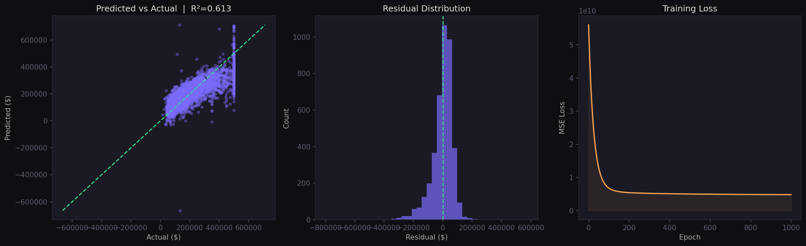

# House Price Regression — NumPy from Scratch

Linear regression built from scratch using only NumPy — no sklearn, no shortcuts.
Trained on the California Housing dataset to predict median house values.

## What's implemented
- Gradient descent optimizer (manual weight + bias updates)
- Train/test split with shuffle
- Feature standardization
- Feature engineering (rooms per household, bedrooms per room, population per household)

## Results
| Metric | Value |
|--------|-------|
| RMSE | $72,140 |
| MAE | $51,533 |
| R² | 0.6134 |

## Visualizations


Three-panel dark-themed dashboard:
- Predicted vs Actual scatter
- Residual distribution
- Training loss curve

## Stack
- Python, NumPy, Pandas, Matplotlib
- Dataset: [California Housing — Kaggle](https://www.kaggle.com/datasets/shibumohapatra/house-price)

## Run
```bash
pip install kagglehub pandas numpy matplotlib
python House.py
```
